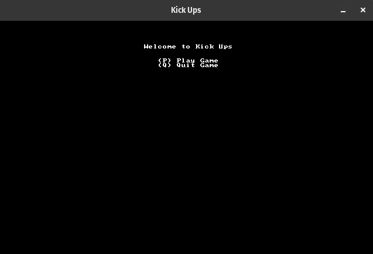
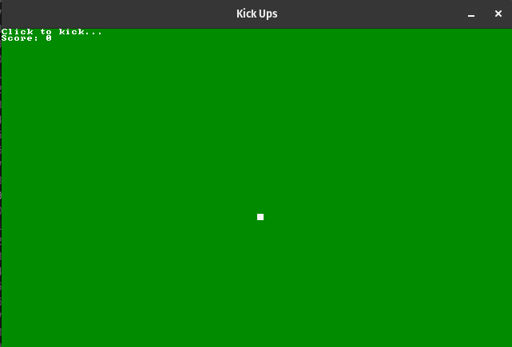
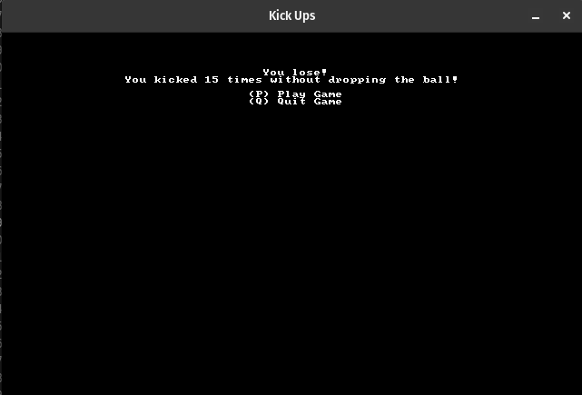

# Kick Ups
This is a simple game written in Rust. The goal is to kick the ball without letting it touch the ground.

### Inspiration
Kick Ups is a modification from a game called **Flappy Dragon**. This game is implemented by **Herbert Wolverson** in his book [Hands-on Rust](https://hands-on-rust.com/ "Hands-on Rust").

Hands-on Rust is a great way to learn the fundamentals of game development as well as Rust programming language.

### Challenges
In the original Flappy Dragon the main concern were to update the drangon's y position. Kick Ups introduced the challenge to deal, not only with the ball's y **and** x axis, but with the  screen boundaries too.
Another challenge was to implement the hit box logic. That envolved increasing the size of the ball and to verify if the pointer of the mouse hit the area of the ball.
When we hit the right or left side of the ball, it gains negative or positive velocity in the x axis respectively. When we hit the center, it doesn't increase the x velocity.

## The game
Kick Ups is very simple to play. You only have to click the ball to kick it. Try to do so without drop the ball to the ground.

## Screenshots
### Main menu

### Game Play

### Lose menu

